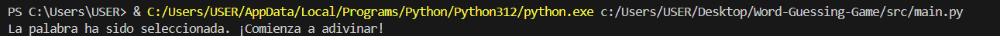

# Actividad 9

En esta Actividad se realizará un proyecto de un juego en el cual el jugador debe adivinar una palabra secreta letra por letra. El juego mostrará el progreso del jugador, incluyendo las letras correctas adivinadas y las letras faltantes. Se implementarán funcionalidades como selección aleatoria de palabras, sistema de pistas limitadas, y control de intentos fallidos. Así también esta actividad se enfocará en la implementación de BDD uilizando Gherkin para definir y automatizar pruebas, así como en la gestión de versiones y despliegue del proyecto mediante GitHub y GitHub Actions.

# Índice
 ## [1. Sprint 1: Configuración de repositorios y flujo de trabajo básico](#sprint-1-configuración-de-repositorios-y-flujo-de-trabajo-básico)
 ## [2. Sprint 2: Desarrollo colaborativo y control de versiones](#sprint-2-desarrollo-colaborativo-y-control-de-versiones)
 ## [3. Sprint 3: Despliegue y gestión de versiones](#sprint-3-despliegue-y-gestión-de-versiones)

---

## Sprint 1: Configuración de repositorios y flujo de trabajo básico
### Objetivo: Configurar el proyecto en GitHub, preparar la estructura básica del juego, y establecer el flujo de trabajo.
1. Creamos la estructura básica del proyecto:
```bash
mkdir src tests
touch src/main.py words.txt README.md .gitignore
```
2. Como se vería:

```graphql
word-guessing-game/
├── src/
│   └── main.py       # Archivo principal del juego
├── tests/            # Directorio reservado para pruebas futuras
├── words.txt         # Archivo de texto con las palabras del juego
├── .gitignore        # Archivo para exclusiones de Git
└── README.md         # Archivo README con la descripción del proyecto

```
3. Rellenamos el README.md

```md
# Word Guessing Game

Este proyecto es un juego de adivinanza de palabras desarrollado utilizando prácticas de BDD. 
El objetivo del juego es adivinar la palabra secreta letra por letra. Se mostrarán las letras correctas adivinadas y las faltantes. 

## Cómo ejecutar el juego

Para ejecutar el juego, corre el siguiente comando: `python src/main.py`

```

4. Configurar el archivo .gitignore con las siguientes exclusiones:
```md
# Entornos Virtuales
.venv/
__pycache__/
*.pyc

``` 
5. Mensaje de bienvenida en `main.py`:
```python
print("Bienvenido al Juego de Adivinanza de Palabras!")
print("La configuración inicial del juego se ha completado.")
```
6. Palabras agregadas a .txt
```txt
perro
gato
computadora
programacion
automovil
manzana
```
7. Resultado del Sprint 1:


---

## Sprint 2: Desarrollo colaborativo y control de versiones

### Objetivo: Implementar las funcionalidades clave del juego, incluyendo la lógica de adivinanza, la selección de palabras aleatorias, y el sistema de pistas.


1. Creamos un archivo `word_selector.py` en `src` y editamos:
```python
import random
import os

def seleccionar_palabra():
    """Selecciona una palabra aleatoria de words.txt y muestra un mensaje de confirmación."""
    # Obtener la ruta absoluta del archivo words.txt
    ruta_actual = os.path.dirname(os.path.abspath(__file__))
    ruta_words = os.path.join(ruta_actual, '../words.txt')
    
    # Abrir el archivo words.txt usando la ruta absoluta
    with open(ruta_words, 'r') as file:
        palabras = file.readlines()

    # Seleccionar una palabra aleatoria
    palabra_seleccionada = random.choice(palabras).strip()

    # Imprimir el mensaje solicitado
    print("La palabra ha sido seleccionada. ¡Comienza a adivinar!")
    return palabra_seleccionada


```
2. Se confiura el main:

```python
from word_selector import seleccionar_palabra

seleccionar_palabra()
```
3. **Resultado:**



4. Luego se crea un archivo `game_logic` y editamos:
```python
# src/game_logic.py

def adivinar_letra(letra, palabra, progreso, intentos_restantes):
    # Verificar si la letra está en la palabra secreta
    if letra in palabra:
        # Actualizar el progreso con la letra adivinada
        progreso = [letra if letra == c else progreso[i] for i, c in enumerate(palabra)]
        mensaje = f"¡Correcto! La letra '{letra}' está en la palabra."
    else:
        # Reducir el número de intentos restantes si la letra no está en la palabra
        intentos_restantes -= 1
        mensaje = f"La letra '{letra}' no está en la palabra. Te quedan {intentos_restantes} intentos."

    # Retornar el progreso actualizado, los intentos restantes y el mensaje
    return progreso, intentos_restantes, mensaje
```
5. Se actualiza la `main`
```python
from game_logic import adivinar_letra

def main():
    # Seleccionar la palabra secreta
    palabra = seleccionar_palabra()

    # Inicializar el progreso con guiones bajos y los intentos restantes
    progreso = ['_'] * len(palabra)
    intentos_restantes = 5  # Número máximo de intentos permitidos


    print(f"Palabra: {' '.join(progreso)}")

    # Bucle principal del juego
    while intentos_restantes > 0 and '_' in progreso:
        # Solicitar al jugador que adivine una letra
        letra = input("Adivina una letra: ").lower()

        # Llamar a la función adivinar_letra para verificar la letra y actualizar el progreso
        progreso, intentos_restantes, mensaje = adivinar_letra(letra, palabra, progreso, intentos_restantes)

        # Mostrar el mensaje de retroalimentación
        print(mensaje)
        print(f"Palabra: {' '.join(progreso)}")

    # Verificar si el jugador ganó o perdió
    if '_' not in progreso:
        print(f"¡Felicidades! Has adivinado la palabra: {palabra}")
    else:
        print(f"Lo siento, has perdido. La palabra era: {palabra}")
``` 
5. **Resultado**


6. Se agrega la función `dar_pista()` en `game_logic.py`
```python
def dar_pista(palabra, progreso, pistas_disponibles):
    # Verificar si hay pistas disponibles
    if pistas_disponibles > 0:
        # Crear una lista de letras que aún no han sido adivinadas
        letras_faltantes = [letra for letra, prog in zip(palabra, progreso) if prog == '_']

        # Seleccionar una letra aleatoria de las letras faltantes
        if letras_faltantes:
            pista = random.choice(letras_faltantes)
            # Actualizar el progreso con la letra revelada
            progreso = [pista if c == pista else p for c, p in zip(palabra, progreso)]
            pistas_disponibles -= 1  # Reducir la cantidad de pistas disponibles
            mensaje = f"Pista: La letra '{pista}' está en la palabra."
        else:
            mensaje = "No quedan letras por revelar."
    else:
        mensaje = "No te quedan pistas disponibles."
    
    return progreso, pistas_disponibles, mensaje
```
7. Se integra `dar_pista()` en `main.py`
```python
from game_logic import adivinar_letra, dar_pista
def main():
# Resto del código
pistas_disponibles = 3  # Número máximo de pistas permitidas
# Resto del código
        # Preguntar al jugador si necesita una pista si aún quedan pistas disponibles
        if intentos_restantes > 0 and '_' in progreso and pistas_disponibles > 0:
            usar_pista = input("¿Necesitas una pista? (s/n): ").lower()
            if usar_pista == 's':
                progreso, pistas_disponibles, mensaje_pista = dar_pista(palabra, progreso, pistas_disponibles)
                print(mensaje_pista)
```
8. **Resultado**

## Sprint 3: Despliegue y gestión de versiones

### Objetivo: Completar el juego, preparar para el despliegue, y gestionar las versiones de manera efectiva.


1. Crear `setup.py`para empaquetar el proyecto de Python. Este archivo debe incluir el nombre del paquete, la versión, la descripción, el autor y las dependencias necesarias. Facilita la instalación y distribución del proyecto.
```python
from setuptools import setup, find_packages

setup(
    name='word_guessing_game',
    version='1.0.0',
    packages=find_packages(where="src"),
    package_dir={"": "src"},
    entry_points={
        'console_scripts': [
            'word-guessing-game = src.main:main',
        ],
    },
    description='Juego de adivinanza de palabras desarrollado en Python.',
    author='Renato Olivera',
    author_email='renato.olivera.c@uni.pe',
    install_requires=[],
)
```
2. Configurar el `yml` para automatizar la construcción del proyecto de Python. Esto facilitará la creación de una versión descargable, asegurando que las dependencias estén instaladas y que el paquete esté correctamente formado antes de ser subido como un artefacto.
```yml
name: Package and Release

on:
  push:
    branches:
      - main
      - feature/deploy-and-version-management  # Agregar la rama actual para despliegue
  pull_request:
    branches:
      - main
      - feature/deploy-and-version-management  # Agregar la rama actual para PR

jobs:
  build:
    runs-on: ubuntu-latest  # Usar la última versión de Ubuntu para el entorno

    steps:
      - name: Checkout code
        uses: actions/checkout@v2  # Clonar el repositorio

      - name: Set up Python
        uses: actions/setup-python@v3
        with:
          python-version: '3.x'  # Especificar la versión de Python

      - name: Install dependencies
        run: |
          pip install -r requirements.txt  # Instalar dependencias desde requirements.txt

      - name: Install setuptools and wheel
        run: |
          python -m pip install --upgrade pip  # Actualizar pip a la última versión
          pip install setuptools wheel  # Instalar setuptools y wheel

      - name: Create binary distribution
        run: |
          python setup.py bdist_wheel  # Crear la distribución binaria

      - name: Upload artifact
        uses: actions/upload-artifact@v3
        with:
          name: word-guessing-game  # Nombre del artefacto
          path: dist/*.whl  # Ruta del archivo de distribución

```
3. Agregar `tags` indicando las versiones.


4. Se realiza una PR y se acepta, tal como se realizó en la `PC1` de este curso. Las PR son fundamentales para trabajar en equipo.


## Recomendaciones:
- Trabajar con `Git Flow` porque ayuda a organizar mejor las características, correcciones y lanzamientos de tu proyecto, incluso si trabajas solo. Esto facilita la gestión de versiones y el mantenimiento del código a largo plazo.
- Leer documentación de repositorios de GitHub para resolver conflictos y optimizar el uso de herramientas como pull requests y revisiones.
- Establecer convenciones de nombres para ramas **(por ejemplo, feature/, bugfix/, release/)** para mejorar la claridad y la organización del proyecto, facilitando el seguimiento de cambios.
- Incluir pruebas automatizadas en el flujo de trabajo para asegurar la calidad del código, lo que es especialmente valioso al añadir nuevas características o realizar cambios.